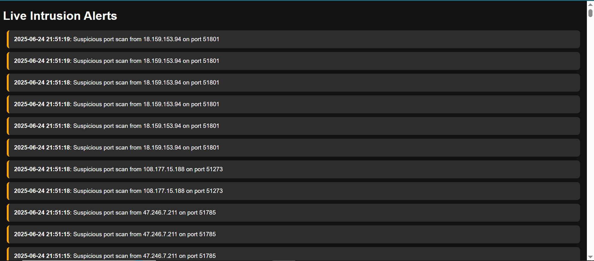
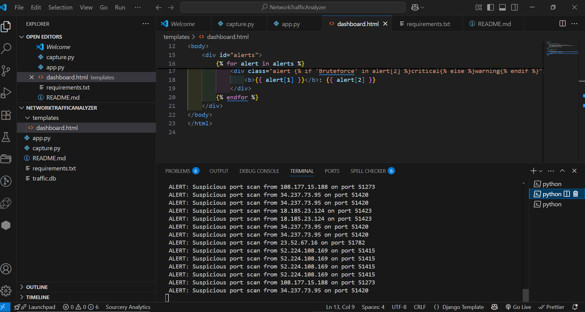
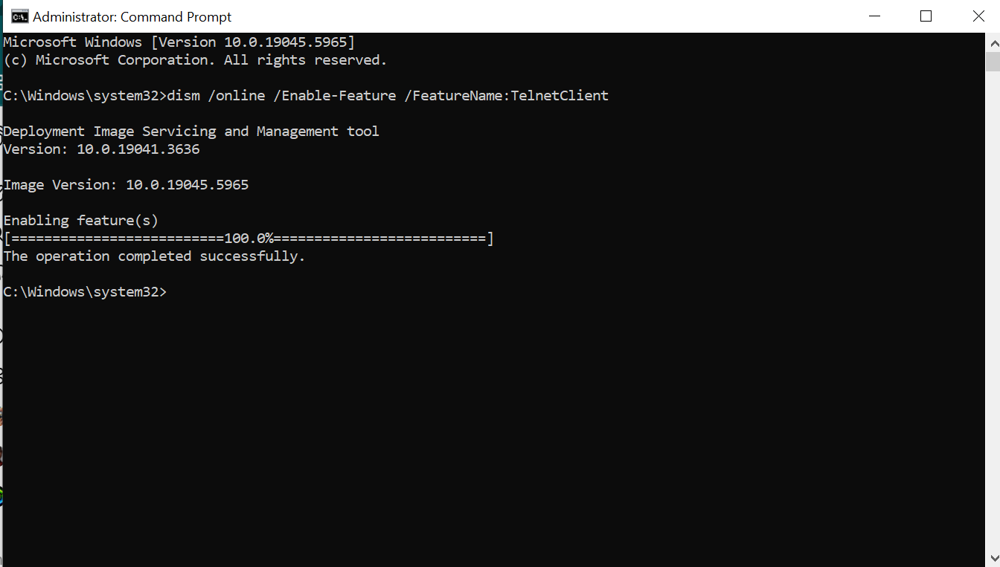
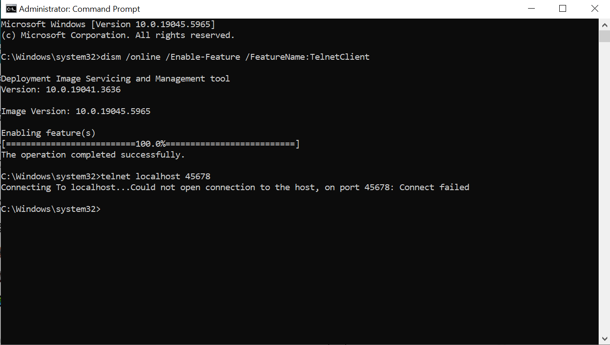

#  Network Traffic Analyzer with Real-time Intrusion Detection  
**Python-based cybersecurity tool that detects port scans, brute-force attacks, and suspicious network activity**

[](https://python.org)
[](https://scapy.net)
[](https://flask.palletsprojects.com)



##  Live Demo  
[](media/videos/live-demo.mp4)  
*(Click to watch full HD video)*

##  Features
- **Real-time Packet Analysis**: Monitor TCP traffic for suspicious activity
- **Threat Detection**: Identify port scans and SSH brute-force attacks
- **Live Dashboard**: Web-based UI showing active threats
- **Alert Logging**: SQLite database stores all security events
- **Lightweight**: Runs on any machine with Python

##  Screenshots
| Dashboard Overview | Attack Detection | 
|--------------------|------------------|
|  |  | 

| Terminal Operations | Bruteforce Alert |
|---------------------|------------------|
|  |  |

##  Installation
1. Clone the repository:
   ```bash
   git clone https://github.com/yourusername/NetworkTrafficAnalyzer.git
   cd NetworkTrafficAnalyzer
   ```
2. Install dependencies:
   ```bash
   pip install -r requirements.txt
   ```

## Running the Project
1. **Start packet capture** (in Terminal 1):
   ```bash
   python capture.py
   ```
2. **Launch dashboard** (in Terminal 2):
   ```bash
   python app.py
   ```
3. Access the dashboard at:  
   [http://localhost:5000](http://localhost:5000)

##  Simulating Attacks
Test the system by running these in **separate terminals**:
```bash
# Simulate port scan (trigger alert)
telnet localhost 45678

# Simulate SSH brute-force (trigger critical alert)
ssh user@localhost
# Enter wrong password 4+ times
```

## 📂 Project Structure
```
NetworkTrafficAnalyzer/
├── capture.py          # Packet sniffer + threat detection
├── app.py              # Flask dashboard server
├── requirements.txt    # Dependencies
├── traffic.db          # Alert database (auto-generated)
├── media/              # Demo assets
│   ├── screenshots/    # Project screenshots
│   ├── videos/         # Full demo videos
│   ├── demo-preview.gif
└── templates/          # Dashboard HTML
    └── dashboard.html
```

## 🛡️ Detection Capabilities
| Threat Type          | Detection Method                     | Alert Level |
|----------------------|--------------------------------------|-------------|
| Port Scan            | High port (>10000) access            | ⚠️ Warning  |
| SSH Bruteforce       | Multiple failed SSH logins           | 🔴 Critical |
| Suspicious Traffic   | Custom rules (expandable)            | ⚠️ Warning  |

## 🤝 Contributing
This project welcomes improvements! To add:
1. New detection rules (DDoS, SQL injection patterns)
2. Email/SMS alert integration
3. Enhanced dashboard visuals

Submit pull requests to the `dev` branch.

##  License
MIT License - see [LICENSE](LICENSE) for details

---

> **Show your support** - ⭐ Star this repo if you found it useful!  
> Connect with me on [LinkedIn](https://www.linkedin.com/in/mosehla-charles-maponya) for cybersecurity discussions.
> git clone https://github.com/CharlesMCMaponya/NetworkTrafficAnalyzer.git

